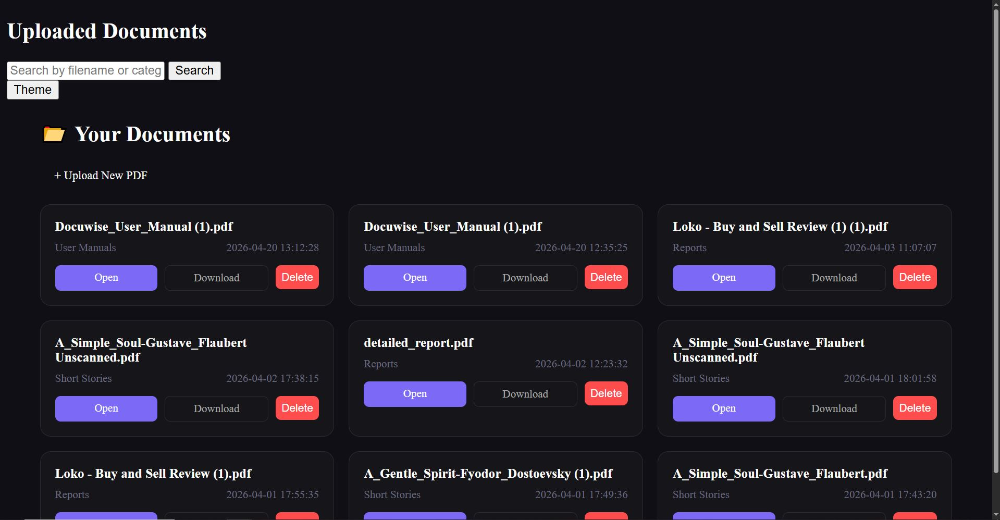
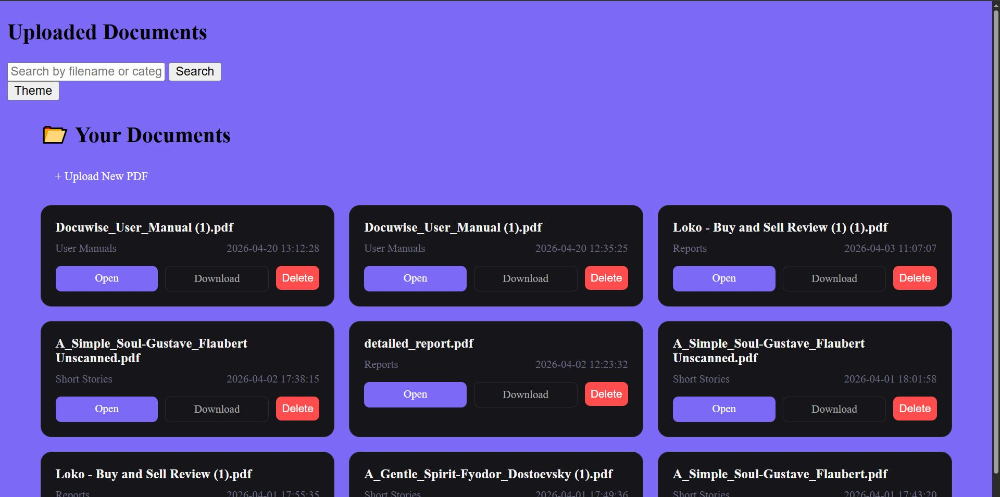
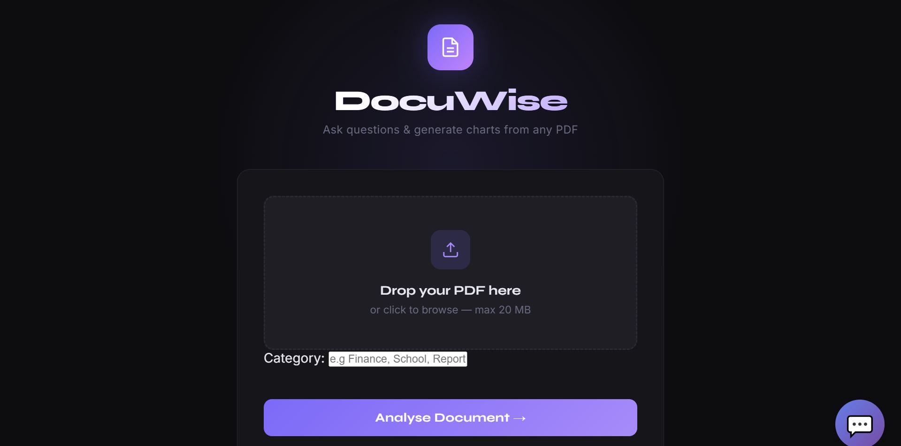
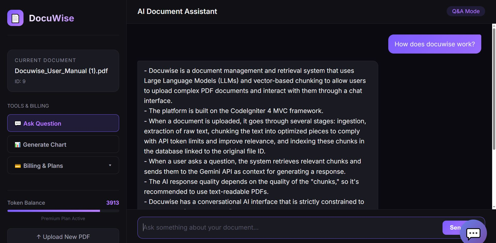
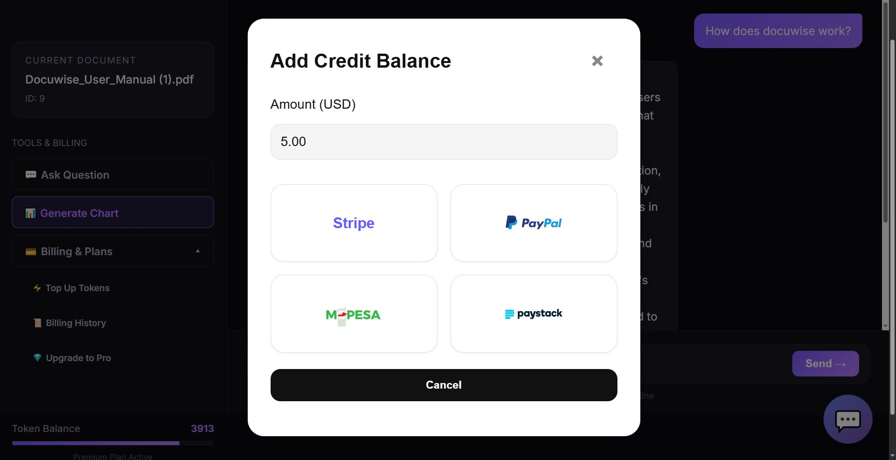
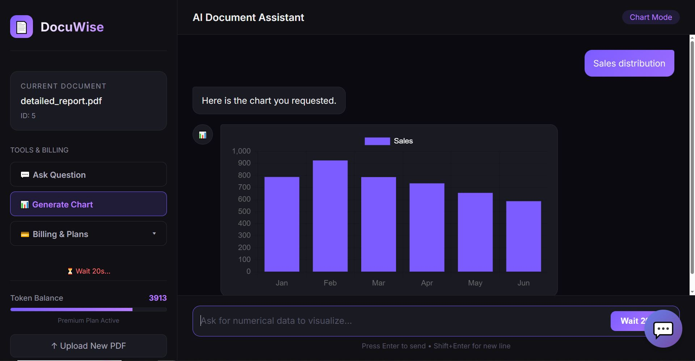

# DocuWise 🤖📄

DocuWise is a production-ready, persistent Retrieval-Augmented Generation (RAG) web analytics portal designed to systematically parse, chunk, validate, and execute complex semantic queries over multi-document PDF uploads using the Gemini API. It features a complete tokenomics engine backed by multi-gateway FinTech pipelines to handle live multi-tier monetization.

---

## 🚀 Key Features

* **Advanced PDF Ingestion & Normalization:** Streamlined file processing pipeline that eliminates document encoding noise and features custom regex-based text "glue" logic to repair text segmentation artifacts.
* **Overlapping Semantic Text Chunking:** Implements customized sliding-window text splitting to ensure maximum context retention and token-efficient payload delivery to the model.
* **Contextual RAG Chat Interface:** Deeply integrated with the Gemini API to execute context-aware, low-latency analytics against targeted document IDs, minimizing hallucination risks.
* **Live Visual Analytics & Charting:** Leverages client-side visualization scripts to map structured data schemas directly out of conversational payloads into interactive UI graphs.
* **FinTech Payment Pipelines & Tokenomics:** Engineered with a unified `Billing` infrastructure natively processing secure card and mobile money entryways (Paystack, Stripe, PayPal) to sustain an active user token-balance database.

---

## 🛠️ Built With

* **AI Engine:** Gemini API
* **Backend Framework:** PHP (CodeIgniter Architecture) / Python Data Utilities
* **Database Engine:** MySQL (Relational Schema Optimization, Indexed Transaction Logging)
* **FinTech Gateways:** Stripe API, Paystack API (KES/USD Conversions), PayPal SDK
* **DevOps Infrastructure:** Linux Environment, Nginx Routing, Encrypted Environment Variables (`.env`)

---

## ⚙️ Core Architecture Lifecycle

The application handles full-cycle data orchestration through a secure, modular Model-View-Controller pattern:
1. **Ingestion (`UploadController`):** Validates strict MIME-type rules, stores documents securely, extracts raw strings with `PdfParser`, applies string-repair encodings, and chunks content into predictable data buffers.
2. **Conversation & Context (`DocumentController` & `ChatController`):** Tracks current active session contexts and executes stateful queries against the target dataset via dedicated AI services.
3. **Transaction Pipelines (`Billing` & `PaystackController`):** Provisions automated token allotments, enforces strict currency rate math (e.g., USD to KES multipliers), logs atomic history rows, and handles automated payment server webhooks safely.

---

## 📸 Application Showcase

### 📊 Document Intelligence & Upload Hub
The primary portal landing page supporting secure multi-category PDF uploads, featuring dynamic status logs tracking extraction pipelines and active data indexes.


### 🤖 Multi-Document Analysis & Category Filtering
An advanced administrative directory organizing processed corpora by custom categories, complete with file deletion triggers and quick-search querying.


### 💬 Contextual RAG Chat Interface
Executing live natural language processing over targeted document streams. The chat context pulls strict reference IDs directly from vector-adjacent datasets before leveraging the Gemini API.


### 📈 Predictive Analytics & Live Data Charting
DocuWise transforms standard textual data into actionable data schemas. Below is the live Chart.js integration mapping analytics directly within the conversational layout.


### 💳 Integrated Billing & Token Tokenomics
A secure, production-grade transaction flow utilizing a tiered credit system. Built with multi-gateway configurations to capture financial pipelines seamlessly.


### 🔐 Multi-Gateway Checkout Environment
Direct client-side checkout integration processing secure token purchasing workflows seamlessly across global payment gateways.


---

## 🔧 Getting Started

### Prerequisites
* PHP 8.1+ (with curl, json, and iconv extensions enabled)
* Composer (for dependency injection)
* MySQL Server Instance
* Gemini API Key

### Installation & Local Setup
1. Clone the repository:
   ```bash
   git clone [https://github.com/koome1400/DocuWise.git](https://github.com/koome1400/DocuWise.git)
   cd DocuWise
